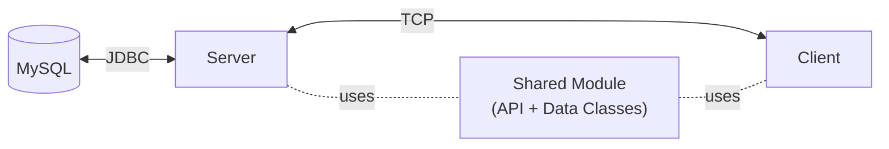

<p align="center">
  
</p>

## Overview

This project spanned a full semester of our software engineering degree. We were given a case description of a fictional food ordering company and asked to design and build its system. The course required a desktop application with a client-server architecture, although a real product of this kind would more likely be a website or mobile app.

The company, BiteMe, works with partner restaurants across three regional branches (North, Center and South), and its system covers the whole life of an order. Customers place orders, restaurants approve and prepare them, and if needed, the company's couriers deliver them.

Most of the work went into planning the project and designing the system, and the code was developed from that design. For the implementation, the course also required OCSF (Object Client-Server Framework) for the communication between client and server.

For most of us, it was the first time developing a complete system end to end: the server, the user interface, the database and the communication between them.

## Capabilities by User Type

| User | Capabilities |
|---|---|
| Customer | Browse restaurants by branch, customize and order dishes for takeaway or delivery, now or in advance, pay by card or with refund credit, and track their orders |
| Restaurant | Approve incoming orders and mark them ready, which notifies the customer |
| Restaurant Employee | Manage the restaurant's menu |
| Branch Manager | Register new customers and view the branch's monthly reports |
| CEO | View every branch's monthly reports and compare quarterly reports across branches |

## Business Rules

- **Delivery Options:** takeaway is free, and basic delivery costs ₪25. Business customers can also choose shared delivery for a group: ₪25 for one participant, ₪40 for two, and ₪15 per participant for three or more.
- **Pre-Orders:** a delivery ordered at least two hours in advance is a pre-order and gets a 10% discount.
- **Late Deliveries:** when the customer confirms an order arrived, it is marked on time or late. A regular order is late if it arrives more than 60 minutes after the restaurant approved it. A pre-order is late if it arrives more than 20 minutes after the requested time. Late orders refund 50% of the price to the customer's wallet.
- **Reports:** at the start of each month, the server automatically generates the previous month's reports for every branch, in the background, without interrupting client requests.
- **Accounts:** a customer can log in only after a branch manager has registered them, and each user can be logged in from one place at a time.

## Screenshots

**Restaurant Selection**


**Menu**


**Quarterly Reports (CEO)**


**Monthly Reports**


## Tech Stack

| Tool | Purpose |
|---|---|
| JavaFX (FXML + CSS) | Provides the UI elements of both the client and the server, such as buttons, tables and charts. Each screen's layout is defined in an FXML file and styled with CSS, separate from the Java controller class that handles its logic. |
| OCSF | A Java framework that handles the networking between the client and the server. It keeps a TCP connection open between each client and the server. TCP is the standard internet protocol for reliable connections: data arrives complete and in order, so a message such as a placed order reaches the other side intact. Over that connection, the client and server send each other complete Java objects instead of raw text. To do that, OCSF converts each object into bytes, the binary form in which data travels over the network, and rebuilds the object on the other side. |
| MySQL 8.0 | A relational database, which stores data in tables that are linked to each other. It holds all of the system's data. |
| JDBC + MySQL Connector/J 8.0.13 | How the server communicates with the database. The queries are written in SQL, the standard language for relational databases. JDBC is Java's standard way of sending SQL queries from Java code and reading back the results. Since JDBC works with any database, it needs a driver: a library that implements it for one specific database. Connector/J is MySQL's driver. |
| Eclipse | The IDE used to write, run and debug the code. |
| Scene Builder | Visual editor for the JavaFX screens. Layouts were built by arranging components visually, and Scene Builder generated the FXML files that the application loads. |

## Architecture



The system is made of two applications, the client and the server, and a shared module that both of them use. The shared module defines the API between them: about 30 request types, such as placing an order or fetching a report, each with a matching response type. It also holds the data classes that are sent through the API, such as users, orders and items.

Each user runs their own copy of the client, and all clients connect to a single server. Clients never access the database directly. Every request goes to the server, which queries the database and sends back the result, so the database stays behind the server and all clients see the same data.

## Project Structure

```
bite-me/
├── Client/          Client application
│   └── src/
│       ├── client/  Connection to the server and the request API
│       ├── gui/     Screen controllers, FXML views, styles and images
│       └── ocsf/    OCSF, client side
├── Server/          Server application
│   └── src/
│       ├── Server/  Server startup and request handling
│       ├── db/      Database queries and report generation
│       ├── gui/     Server control screen
│       └── ocsf/    OCSF, server side
├── Common/          Code shared by the client and server
│   └── src/
│       ├── entities/    Users, orders, items, reports
│       ├── enums/       Client-server API (request and response types), branches, user types
│       └── containers/  Message wrappers for requests and responses
└── JavaDoc/         Generated API documentation
```

## Getting Started

### Requirements
- Java 8 with JavaFX (included in Oracle's Java 8)
- MySQL Server 8.0

> [!NOTE]
> Oracle's support for JavaFX in Java 8 is planned to end in March 2025, and later Java 8 updates may no longer include it. Java is open source, and other vendors publish free builds of the same Java 8, some of which include JavaFX. If your Java 8 doesn't include JavaFX, install one of these instead:
> - [Azul Zulu](https://www.azul.com/downloads/): choose Java 8 and the **JDK FX** package
> - [BellSoft Liberica](https://bell-sw.com/pages/downloads/): choose JDK 8 and the **Full** edition

### Installation

1. **Download** the files from the [release](https://github.com/tomerot/bite-me/releases/latest):
   - `server.jar` and `client.jar`: the applications
   - `database.sql`: the database schema and sample data
   - `external-customers-data.zip` *(optional)*: sample customers for the import feature (see [Importing Customers](#importing-customers-optional))
2. **Set up the database.** Create a database named exactly `biteme` and import `database.sql` into it, using MySQL Workbench or the command line:
   ```
   mysql -u root -p -e "CREATE DATABASE biteme"
   mysql -u root -p biteme < database.sql
   ```
3. **Start the server.** Run `server.jar`, by double-clicking it or with `java -jar server.jar`. The database address (`localhost`), name (`biteme`) and port (`5555`) are already filled in. Enter your MySQL username and password and click **Connect to server**. The server then shows the IP address that clients should connect to.
4. **Start the client.** Run `client.jar`, enter the server's IP address and port, and connect. If the client runs on the same computer as the server, use `localhost`. Otherwise, use the IP address the server shows.

> [!NOTE]
> For the demonstration, the system was required to run on the college's computers, whose network access is restricted for security reasons. Since those computers couldn't communicate with an external server, the server wasn't deployed to a real host, as a production system would be. Instead, it ran on one of the college's computers, and its IP address was only known once it was running. This is why the server's IP address needs to be entered when opening the client.

### Importing Customers (optional)

In the case description, new customers come from a company's existing customer system, and branch managers register them in BiteMe. `external-customers-data.zip` is used to simulate an export from that system.

1. Extract the two CSV files into MySQL's import folder. On Windows, this is usually `C:\ProgramData\MySQL\MySQL Server 8.0\Uploads\`. To check yours, run `SHOW VARIABLES LIKE 'secure_file_priv';`
2. On the server screen, confirm the folder path and click **Import Customer Information**. The import can run once per server session.
3. Log in as the branch manager of the customers' branch to register them.

### Demo Accounts

The sample data includes restaurants, customers and reports from the first half of 2024. January–March has every report type for every branch, so it's a good place to start. Some accounts to start with:

| User type | Username | Password |
|---|---|---|
| CEO | `CEO` | `CEO` |
| Branch manager (South) | `South` | `South` |
| Restaurant (McDonald's Beer Sheva) | `Mcdonalds@BS` | `qw3rty` |
| Restaurant employee (McDonald's Beer Sheva) | `E@Mcdonalds1` | `p4ss` |
| Private customer | `C3` | `pass3` |
| Business customer | `C2` | `pass2` |

The other branch managers are `North` and `Center`, with passwords matching their usernames. All customers follow the pattern `C1`–`C45`, with passwords `pass1`–`pass45`.
